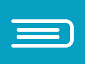

<div  style="margin:5rem 0;
width: 100%;
display: flex;
justify-content:space-between;
flex-direction: column;">
   <h2 align="center" style="font-size: 25px;margin-bottom: 2rem;">Colégio São Cristóvão</h2>
   <div align="center">
    
   </div>
</div>

# 🔖 Descrição
<div style="margin-bottom:5rem;">

<p style="font-size: 15px">O projeto Colégio São Cristóvão tem como objetivo o desenvolvimento de uma aplicação em React que utilize endpoints da API que foi criada no Módulo 4 com
Node.Js e Express;.</p>
<p style="font-size: 15px">Na organização da equipe foi aplicado a metodologia ágil SCRUM, e na divisão das tarefas foi utilizado o método KANBAN com ferramenta Trello.</p>
<p style="font-size: 15px"></p>
<p style="font-size: 15px">Você pode acessar a API utilizada no projeto: <a href="https://github.com/cclsenna/api-escola-modulo4" target="_blank" style="font-size:15px">clique aqui!</a></p>

</div>


# 💻📱 Layout

<div style="width: 100vw; display: flex; justify-content: space-around; align-items: center; margin-bottom: 5rem;">
<div style="width: 35rem; display: flex; flex-direction: column; align-items: center;">
 <p style="text-align:center; font-size: 20px; margin-bottom: 2rem;">💻 Desktop</p>

</div>
<div style="height: 100%;">
<p style="text-align:center; font-size: 20px; margin-bottom: 2rem;"> 📱 Mobile</p>

</div>
</div>

# 👉🏻 Utilização 

<p style="font-size: 15px">É possível você utilizar o nosso projeto seguindos estes passos:</p>
<p style="font-size: 15px">Utilize o Git Clone no repositório em uma pasta de sua escolha</p>


```
$ git clone https://github.com/cclsenna/projeto-modulo5.git
```
<p style="font-size: 15px">Execute o comando a seguir no terminal para instalar as dependências:</p>

```
$ npm i
ou
$ npm install
```

<p style="font-size: 15px">Para executar o projeto digite:</p>

```
$ npm run dev
```
## ou

<p style="font-size: 20px; margin-bottom: 5rem;"><strong>Para acessar o deploy da aplicação:</strong> <a href="https://colegio-sao-cristovao-g1bqm91c1-cclsenna.vercel.app/" target="_blank" style="font-size: 20px">clique aqui!</a></p>

# 🔧 Tecnologias e ferramentas utilizadas

<div style="margin-bottom: 5rem;">


</div>

# 🤵 Desenvolvedores

<ul>
    <li style="font-size:21px"><a href="https://www.linkedin.com/in/caiosenna93/" target="_blank"> Caio Senna</a></li>
    <li style="font-size:21px"><a href="https://www.linkedin.com/in/iata-mendon%C3%A7a/" target="_blank"> Iata Anderson</a></li>
    <li style="font-size:21px"><a href="https://www.linkedin.com/in/rodrigo-william1/" target="_blank"> Rodrigo William </a></li>
</ul>
<br>